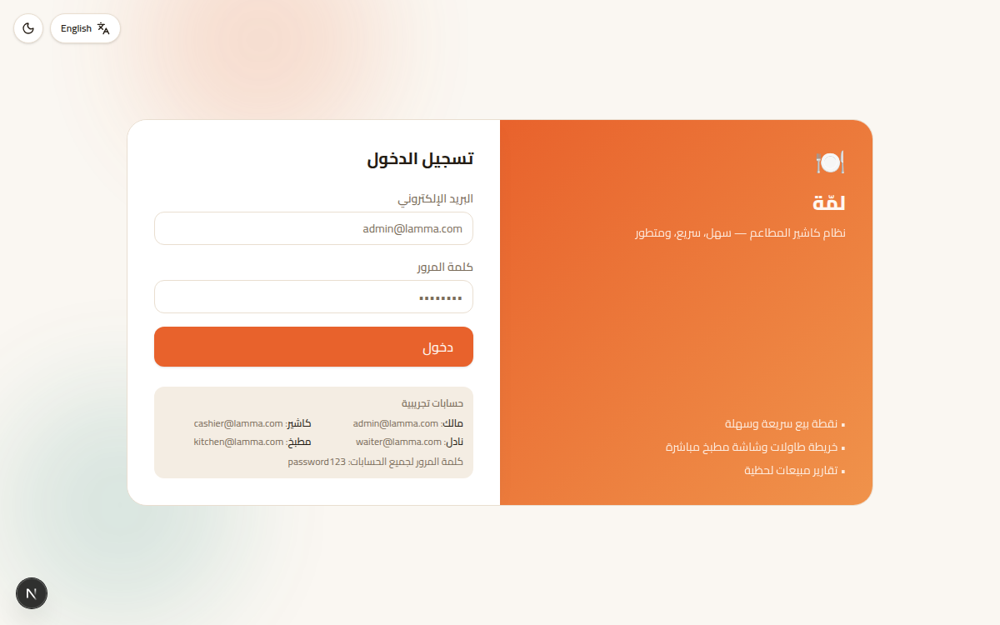
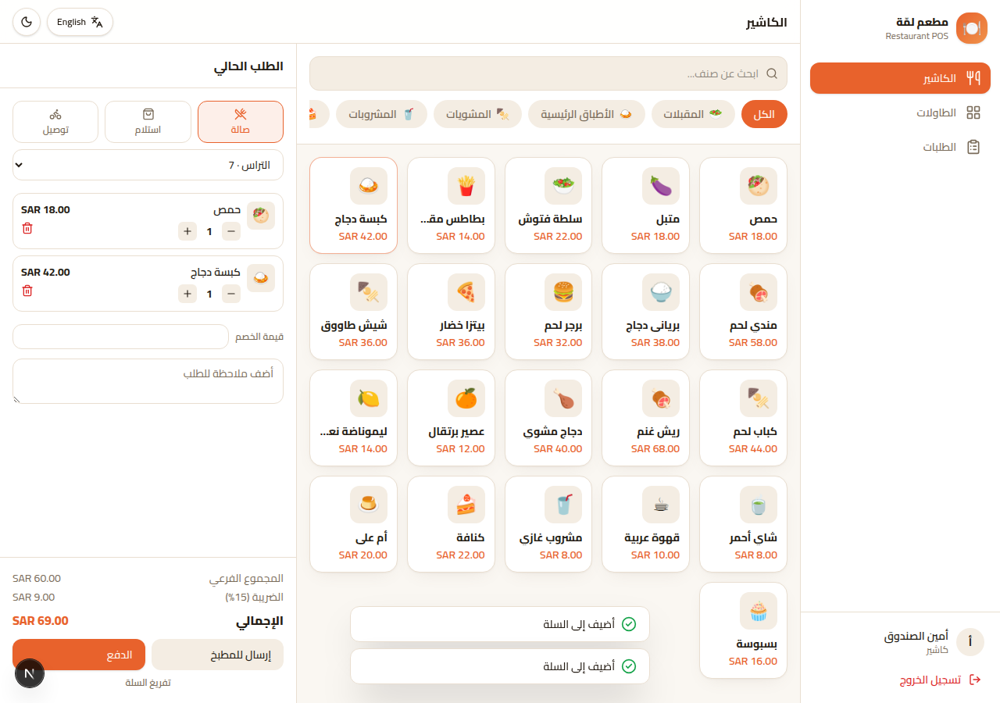
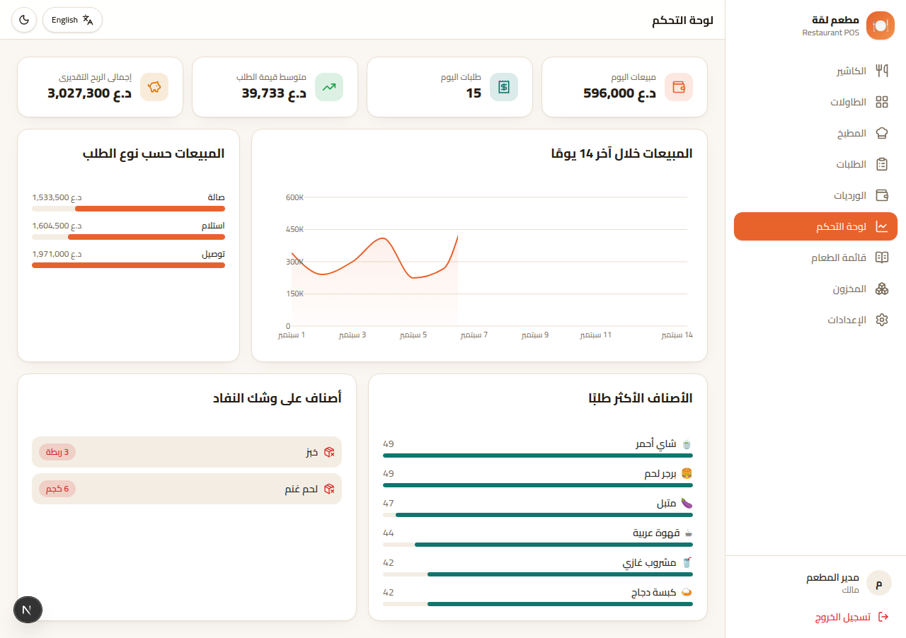
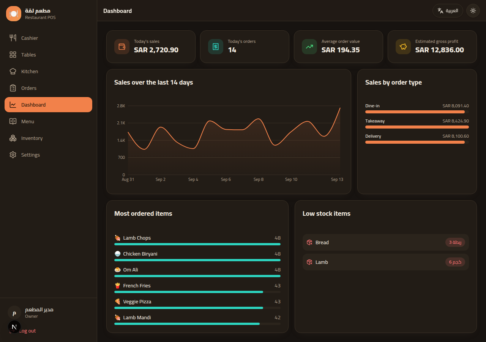
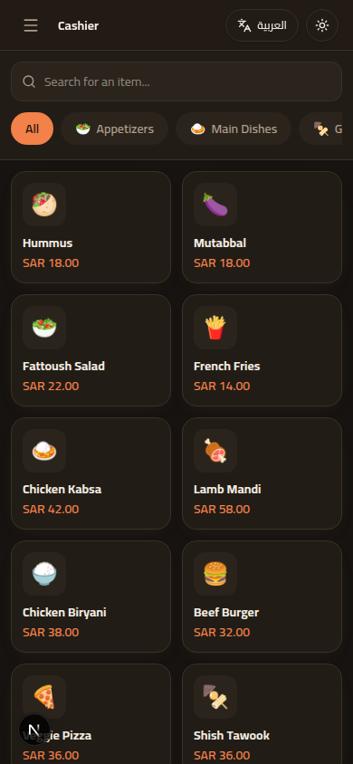
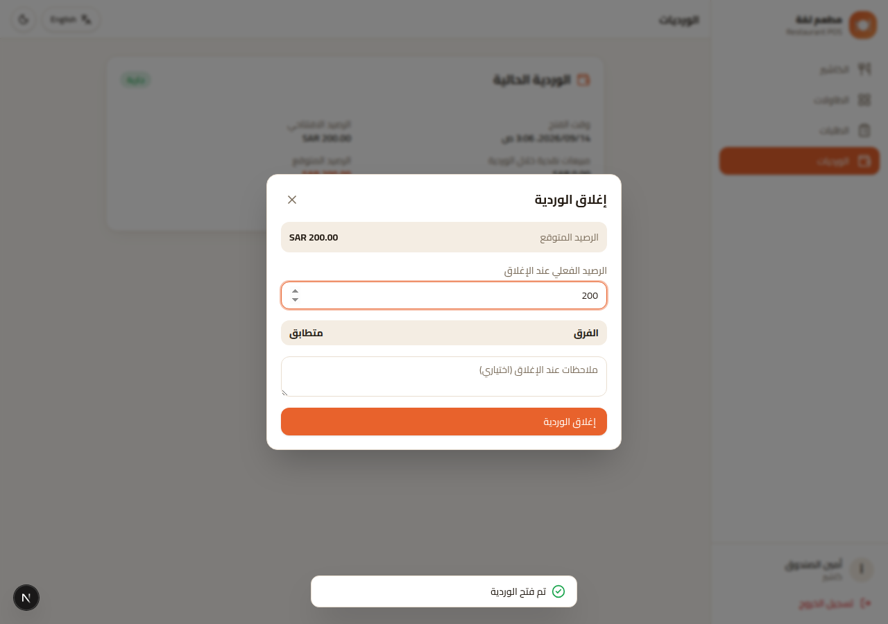

# 🍽️ لمّة — نظام كاشير المطاعم

نظام **كاشير (POS) سهل الاستخدام ومتطور** مصمم خصيصًا للمطاعم: نقطة بيع سريعة،
خريطة طاولات مباشرة، شاشة مطبخ (KDS)، إدارة قائمة الطعام، تقارير مبيعات
لحظية، وإدارة مستخدمين وصلاحيات — كل ذلك بواجهة عربية/إنجليزية (RTL/LTR)
مميزة، متجاوبة بالكامل مع كل المقاسات، وقابلة للتوسّع لاحقًا لتصبح **منتج
SaaS** يُشترك فيه عدة مطاعم.

> An easy, advanced, and genuinely useful restaurant POS system — cashier,
> live table map, kitchen display, menu management, real-time sales
> dashboard, and role-based staff accounts, in a bilingual (Arabic/English,
> RTL/LTR) responsive UI, architected so it can grow into a multi-tenant
> SaaS product down the line.

<p align="center">
  
  
</p>
<p align="center">
  
  
</p>
<p align="center">
  
  
</p>

## ✨ Features

**Point of Sale (`/pos`)**
- Category tabs + live search, tap-to-add menu grid with emoji icons
- Item modifiers (size, extras, required/optional, single/multi-select)
- Dine-in / takeaway / delivery order types, table picker, customer info
- Cart with quantity steppers, per-order discount, notes
- "Send to kitchen" (no payment yet) vs. "Checkout" (cash/card/wallet,
  quick cash amounts, automatic change calculation) — mirrors how a real
  restaurant actually runs a shift (open a tab, add more items, pay later)
- Authoritative server-side re-pricing on every checkout — the client
  never gets to decide what something costs
- Printable, thermal-receipt-styled bill (`/receipt/[id]`)

**Tables (`/tables`)** — live floor plan grouped by zone, color-coded status
(available / occupied / reserved), tap to open or continue an order.

**Kitchen Display (`/kitchen`)** — ticket-style cards per order, auto-refreshing
every 10s, elapsed-time urgency coloring, one-tap status flow per item
(queued → cooking → ready → served) that automatically rolls up to the
order's own status.

**Orders (`/orders`)** — paginated history with status filters, per-order
detail, cancel / continue-to-payment / print, and a CSV export (managers/owner)
for accounting.

**Shifts (`/shifts`)** — cash drawer accountability: a cashier opens a shift
with a starting cash float, sells through the day, then closes it against a
physical count; the system computes the expected cash from that shift's cash
payments and flags any over/short automatically. Managers see every
cashier's shift history.

**Menu management (`/menu`)** — categories and items CRUD, prices & cost
(for profit tracking), availability toggle, reusable modifier groups.

**Dashboard (`/dashboard`)** — today's sales/orders/average ticket, estimated
gross profit, 14-day revenue trend, sales by order type, best sellers,
low-stock alerts.

**Inventory (`/inventory`)** — basic stock tracking with low-stock threshold
alerts.

**Settings (`/settings`)** — restaurant profile (name, logo emoji, currency,
tax rate, address/phone), language & theme, staff accounts with roles
(Owner, Manager, Cashier, Waiter, Kitchen).

**Across the whole app**
- Full Arabic/English UI with correct RTL/LTR layout mirroring, switchable
  from any screen
- Light/dark theme
- Role-based access control (a waiter can't see reports; kitchen staff only
  see the kitchen display, etc.)
- Fully responsive — usable as the primary interface on a phone, tablet, or
  a fixed POS terminal

## 🧱 Tech stack

- **Next.js 16** (App Router, Server Actions, Server Components) + **React 19**
- **TypeScript** end to end
- **Tailwind CSS v4** — custom design system (brand palette, light/dark tokens)
- **Prisma 7** ORM on **SQLite** via the **libSQL** driver adapter (zero
  external services to run locally; swap the adapter for Postgres/Turso to
  scale to production/SaaS — see [Scaling to SaaS](#-scaling-this-into-a-saas-product))
- **Zustand** for the client-side cart state
- **Recharts** for the dashboard chart
- Custom JWT session auth (`jose` + `bcryptjs`, httpOnly cookies) — no
  external auth provider needed

## 🚀 Getting started

```bash
npm install
cp .env.example .env      # then set a real AUTH_SECRET for anything beyond local dev
npm run db:migrate        # creates prisma/dev.db and applies the schema
npm run db:seed           # demo restaurant, menu, tables, users, 14 days of sample sales
npm run dev
```

Open http://localhost:3000 and sign in with any of the demo accounts
(password for all of them: `password123`):

| Role    | Email                | Lands on     |
|---------|-----------------------|--------------|
| Owner   | admin@lamma.com      | Dashboard    |
| Cashier | cashier@lamma.com    | POS          |
| Waiter  | waiter@lamma.com     | POS          |
| Kitchen | kitchen@lamma.com    | Kitchen      |

Other useful scripts: `npm run db:studio` (Prisma Studio), `npm run db:reset`
(wipe + re-migrate + re-seed), `npm run build` / `npm run start` for a
production build.

## 📁 Project structure

```
prisma/                  schema, migrations, seed script
src/
  app/
    login/                public login page
    (app)/                authenticated shell (sidebar/topbar) + all screens:
      pos/ tables/ kitchen/ orders/ menu/ dashboard/ inventory/ settings/ shifts/
    receipt/[id]/         standalone print-friendly receipt (no app chrome)
    api/kitchen/active/   polling endpoint for the kitchen display
  components/             ui/ (primitives), layout/, pos/, tables/, kitchen/,
                          menu/, settings/, inventory/, dashboard/
  lib/
    auth.ts, roles.ts     session + RBAC helpers
    db.ts                 Prisma client (libSQL adapter)
    data/                 read queries, scoped by restaurantId
    actions/              "use server" mutations (orders, menu, settings, …)
    i18n/                 ar/en dictionaries + locale helpers
  stores/cart-store.ts    client cart state (Zustand, persisted)
  proxy.ts                route protection (Next 16's middleware/proxy)
```

## 🔐 Security notes before going live

- Set a strong, random `AUTH_SECRET` (e.g. `openssl rand -base64 32`) — the
  one in `.env.example` is a placeholder only.
- Change or remove the seeded demo accounts.
- Every price is recomputed server-side from the database at checkout, so a
  tampered client request can't discount an order — keep that pattern for
  any new mutation you add.

## 💰 Scaling this into a SaaS product

The data model is already multi-tenant shaped — every operational table
(`Category`, `MenuItem`, `Table`, `Order`, `User`, …) hangs off a single
`Restaurant`. Turning this from "one self-hosted restaurant" into a
subscription product mainly means:

1. **Move off SQLite** — swap the adapter in `src/lib/db.ts` for
   `@prisma/adapter-pg` (Postgres) or keep `@prisma/adapter-libsql` and point
   it at a hosted Turso database; run `prisma migrate deploy` against it.
2. **Restaurant sign-up flow** — a "create my restaurant" page that creates a
   `Restaurant` + first `OWNER` `User`, instead of relying on the seed script.
3. **Billing** — add a subscription/plan field on `Restaurant` and integrate
   a payment provider (Stripe, or a local gateway) to gate features/seats.
4. **Real payment terminals** — the `PaymentMethod` enum and the checkout
   flow are already provider-agnostic; wire `CARD` up to an actual card
   reader/gateway when you're ready.
5. **Online ordering / QR menus, loyalty points, multi-branch reporting** are
   natural next features on top of the existing schema (a `Restaurant` could
   own multiple `Table`/`Order` sets per branch with one more foreign key).

## 🗺️ Known limitations (good next steps)

- Inventory isn't automatically decremented by sales (it's a manual stock
  log today, not a full recipe/BOM system).
- Shifts are tracked per cashier, not per till/terminal — fine for one
  register, worth revisiting for a multi-register floor.
