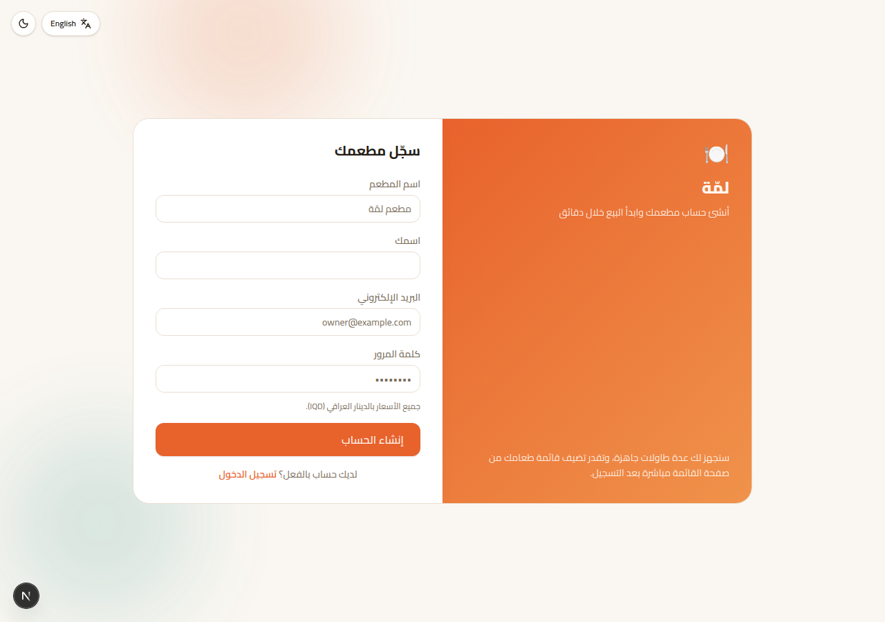

# 🍽️ لمّة — نظام كاشير المطاعم العراقية

نظام **كاشير (POS) سهل الاستخدام ومتطور** مصمم خصيصًا **للمطاعم العراقية**:
كل الأسعار بالدينار العراقي (IQD) من أول يوم، نقطة بيع سريعة، خريطة طاولات
مباشرة، شاشة مطبخ (KDS)، إدارة قائمة الطعام، تقارير مبيعات لحظية، ووردية
كاشير بمطابقة نقدية — كل ذلك بواجهة عربية/إنجليزية (RTL/LTR) مميزة، متجاوبة
بالكامل، وأي مطعم يقدر يسجّل نفسه ويبدأ البيع خلال دقائق (`/signup`)، وقابلة
للتوسّع لاحقًا لتصبح **منتج SaaS** يُشترك فيه عدة مطاعم.

> An easy, advanced, and genuinely useful restaurant POS system built for
> **Iraqi restaurants** — prices in Iraqi Dinar (IQD) from day one, plus
> cashier, live table map, kitchen display, menu management, real-time sales
> dashboard, cash-drawer shift reconciliation, and role-based staff
> accounts, in a bilingual (Arabic/English, RTL/LTR) responsive UI. Any
> restaurant can sign itself up and start selling in minutes, and it's
> architected so it can grow into a multi-tenant SaaS product down the line.

<p align="center">
  
  
</p>
<p align="center">
  
  
</p>
<p align="center">
  
  
</p>
<p align="center">
  
</p>

## ✨ Features

**Point of Sale (`/pos`)**
- Category tabs + live search, tap-to-add menu grid with emoji icons
- Item modifiers (size, extras, required/optional, single/multi-select)
- Dine-in / takeaway / delivery order types, table picker, customer info
- Cart with quantity steppers, per-order discount, notes
- "Send to kitchen" (no payment yet) vs. "Checkout" (cash/card/wallet,
  quick cash amounts, automatic change calculation) — mirrors how a real
  restaurant actually runs a shift (open a tab, add more items, pay later)
- Authoritative server-side re-pricing on every checkout — the client
  never gets to decide what something costs
- Printable, thermal-receipt-styled bill (`/receipt/[id]`)

**Tables (`/tables`)** — live floor plan grouped by zone, color-coded status
(available / occupied / reserved), tap to open or continue an order.

**Kitchen Display (`/kitchen`)** — ticket-style cards per order, auto-refreshing
every 10s, elapsed-time urgency coloring, one-tap status flow per item
(queued → cooking → ready → served) that automatically rolls up to the
order's own status.

**Orders (`/orders`)** — paginated history with status filters, per-order
detail, cancel / continue-to-payment / print, and a CSV export (managers/owner)
for accounting.

**Shifts (`/shifts`)** — cash drawer accountability: a cashier opens a shift
with a starting cash float, sells through the day, then closes it against a
physical count; the system computes the expected cash from that shift's cash
payments and flags any over/short automatically. Managers see every
cashier's shift history.

**Menu management (`/menu`)** — categories and items CRUD, prices & cost
(for profit tracking), availability toggle, reusable modifier groups.

**Dashboard (`/dashboard`)** — today's sales/orders/average ticket, estimated
gross profit, 14-day revenue trend, sales by order type, best sellers,
low-stock alerts.

**Inventory (`/inventory`)** — basic stock tracking with low-stock threshold
alerts.

**Settings (`/settings`)** — restaurant profile (name, logo emoji, currency,
tax rate, address/phone), language & theme, staff accounts with roles
(Owner, Manager, Cashier, Waiter, Kitchen).

**Across the whole app**
- Full Arabic/English UI with correct RTL/LTR layout mirroring, switchable
  from any screen
- Light/dark theme
- Role-based access control (a waiter can't see reports; kitchen staff only
  see the kitchen display, etc.)
- Fully responsive — usable as the primary interface on a phone, tablet, or
  a fixed POS terminal

## 🧱 Tech stack

- **Next.js 16** (App Router, Server Actions, Server Components) + **React 19**
- **TypeScript** end to end
- **Tailwind CSS v4** — custom design system (brand palette, light/dark tokens)
- **Prisma 7** ORM on **SQLite** via the **libSQL** driver adapter (zero
  external services to run locally; swap the adapter for Postgres/Turso to
  scale to production/SaaS — see [Deploying it and putting it on your own domain](#-deploying-it-and-putting-it-on-your-own-domain))
- **Zustand** for the client-side cart state
- **Recharts** for the dashboard chart
- Custom JWT session auth (`jose` + `bcryptjs`, httpOnly cookies) — no
  external auth provider needed

## 🚀 Getting started

```bash
npm install
cp .env.example .env      # then set a real AUTH_SECRET for anything beyond local dev
npm run db:migrate        # creates prisma/dev.db and applies the schema
npm run db:seed           # demo restaurant, menu, tables, users, 14 days of sample sales
npm run dev
```

Open http://localhost:3000 and sign in with any of the demo accounts
(password for all of them: `password123`):

| Role    | Email                | Lands on     |
|---------|-----------------------|--------------|
| Owner   | admin@lamma.com      | Dashboard    |
| Cashier | cashier@lamma.com    | POS          |
| Waiter  | waiter@lamma.com     | POS          |
| Kitchen | kitchen@lamma.com    | Kitchen      |

Other useful scripts: `npm run db:studio` (Prisma Studio), `npm run db:reset`
(wipe + re-migrate + re-seed), `npm run build` / `npm run start` for a
production build.

## 👤 How a real restaurant signs up and logs in

This isn't just the demo data — anyone can create their own restaurant:

1. **`/signup`** — a restaurant owner enters their restaurant's name, their
   own name, an email, and a password. That one submission creates a
   `Restaurant` row (currency defaults to IQD, tax rate to 0%), an `OWNER`
   `User` under it, six starter tables so the floor plan isn't empty, and
   signs them straight in.
2. They land on **`/menu`** and add their own dishes and prices (deliberately
   *not* pre-filled with sample food — a real restaurant's menu should be
   theirs).
3. From **`/settings` → Users**, the owner creates a login for every staff
   member and assigns a role (Manager, Cashier, Waiter, Kitchen). Everyone
   signs in at the same `/login` with their own email/password; the role
   decides what they land on and what they can see.

Every restaurant's data is already isolated by `restaurantId` under the
hood, so this one deployment can host any number of unrelated restaurants —
there's no per-restaurant setup step beyond signing up.

## 📁 Project structure

```
prisma/                  schema, migrations, seed script
src/
  app/
    login/                public login page
    (app)/                authenticated shell (sidebar/topbar) + all screens:
      pos/ tables/ kitchen/ orders/ menu/ dashboard/ inventory/ settings/ shifts/
    receipt/[id]/         standalone print-friendly receipt (no app chrome)
    api/kitchen/active/   polling endpoint for the kitchen display
  components/             ui/ (primitives), layout/, pos/, tables/, kitchen/,
                          menu/, settings/, inventory/, dashboard/
  lib/
    auth.ts, roles.ts     session + RBAC helpers
    db.ts                 Prisma client (libSQL adapter)
    data/                 read queries, scoped by restaurantId
    actions/              "use server" mutations (orders, menu, settings, …)
    i18n/                 ar/en dictionaries + locale helpers
  stores/cart-store.ts    client cart state (Zustand, persisted)
  proxy.ts                route protection (Next 16's middleware/proxy)
```

## 🔐 Security notes before going live

- Set a strong, random `AUTH_SECRET` (e.g. `openssl rand -base64 32`) — the
  one in `.env.example` is a placeholder only.
- Change or remove the seeded demo accounts.
- Every price is recomputed server-side from the database at checkout, so a
  tampered client request can't discount an order — keep that pattern for
  any new mutation you add.

## 🌍 Deploying it and putting it on your own domain

The whole app lives at **one domain** — restaurants don't each need their
own subdomain, because tenancy is decided by *who logs in*, not by which URL
they visit (see the signup/login flow above). So "connecting a domain" is
the same one-time step regardless of how many restaurants sign up later:

1. **Move the database off the local SQLite file** — a serverless host has
   no persistent disk, so `prisma/dev.db` won't survive between requests
   there. The zero-code-change path: create a free
   [Turso](https://turso.tech) database (still libSQL, same
   `@prisma/adapter-libsql` already wired up in `src/lib/db.ts`) and set
   `DATABASE_URL` to its connection string. Prefer Postgres instead? Swap the
   adapter for `@prisma/adapter-pg` and point `DATABASE_URL` at any hosted
   Postgres (Neon, Supabase, Prisma Postgres, RDS, …).
2. **Run migrations against that database**: `npx prisma migrate deploy`.
3. **Deploy the Next.js app.** Easiest is [Vercel](https://vercel.com)
   (`vercel` CLI or connect the GitHub repo) — it's built for Next.js and
   needs no server config. A plain Node host (Railway, Render, a VPS with
   `npm run build && npm run start` behind PM2/Docker) works the same way.
4. **Set environment variables** on that host: `DATABASE_URL` (from step 1)
   and a strong `AUTH_SECRET` (`openssl rand -base64 32`).
5. **Point your domain at it**: in the host's dashboard, add your domain
   (e.g. `pos.yourbrand.com` or a bare `yourbrand.com`), then create the DNS
   record it gives you (usually a `CNAME`, or an `A` record for an apex
   domain) with your domain registrar. SSL is issued automatically by every
   host mentioned above — nothing else to configure.

That's the entire path from "running on my laptop" to "a real product at my
own domain that any restaurant can sign up to." From there, turning it into
a paid product is mostly business logic on top of what already exists:

1. **Billing** — add a subscription/plan field on `Restaurant` and integrate
   a payment provider (Stripe, or a local gateway) to gate features/seats.
2. **Real payment terminals** — the `PaymentMethod` enum and the checkout
   flow are already provider-agnostic; wire `CARD` up to an actual card
   reader/gateway when you're ready.
3. **Online ordering / QR menus, loyalty points, multi-branch reporting** are
   natural next features on top of the existing schema (a `Restaurant` could
   own multiple `Table`/`Order` sets per branch with one more foreign key).

## 🗺️ Known limitations (good next steps)

- Inventory isn't automatically decremented by sales (it's a manual stock
  log today, not a full recipe/BOM system).
- Shifts are tracked per cashier, not per till/terminal — fine for one
  register, worth revisiting for a multi-register floor.
